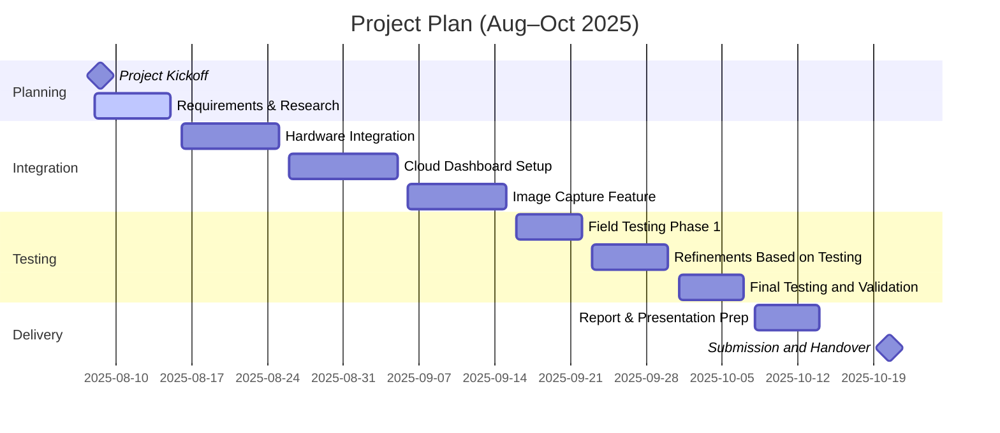

# Project Proposal
Bachelor of Computing Systems

ISCG7431 – CAPSTONE PROJECT

Course Coordinator: Dr Masoud Shakiba  
Course Coordinator: Andrew David

## Project Title
Autonomous Vehicle

- Sponsor: Artem (Project Astra Ltd)  
- Supervisor: Jamie Bell

## Team Members
| Name | Student ID | Email | Phone | Role |
|---|---|---|---|---|
| Harinder Singh | 1513751 | singhh51@myunitec.ac.nz | 0273727701 | Project Manager |
| Param | 1564701 | singhp81@myunitec.ac.nz | 02040006240 | Technical Developer |
| Lewis Hall | 1422956 | halll14@myunitec.ac.nz | 02108080345 | UI/UX & Documentation |

Submission Date: TBC

## Table of Contents
- 1. Document Control
- 2. Executive Summary
- 3. Project Overview
- 4. Problem Statement
- 5. Objectives
- 6. Scope
- 7. Proposed Solution
- 8. Project Management
- 9. Mapping
- 10. Deliverables
- 11. References
- 12. Appendices

## 1. Document Control
### Version History
| Version | Date | Description | Author |
|---|---|---|---|
| 1.0 | 07/08/2025 | Initial Draft | Harinder Singh |
| 1.1 | TBC | Feedback Incorporated | Team Omega |

### Distribution List
| Name | Role | Contact Email |
|---|---|---|
| Jamie Bell | Supervisor | jbell@unitec.ac.nz |
| Artem | Sponsor | artemt179@gmail.com |
| Harinder Singh | Project Manager | singhh51@myunitec.ac.nz |
| Param | Developer | singhp81@myunitec.ac.nz |
| Lewis Hall | Documentation | halll14@myunitec.ac.nz |

### Glossary
- RTK: Real-Time Kinematic GPS  
- LiDAR: Light Detection and Ranging  
- AWS: Amazon Web Services  
- UI/UX: User Interface/User Experience

## 2. Executive Summary
Team Omega is enhancing an autonomous vehicle prototype tailored for orchard environments. This project builds on a prior semester’s model to improve its autonomous capabilities and usability in real farm settings. The enhancements integrate advanced sensing technologies such as LiDAR and high-resolution cameras for precise obstacle detection and navigation. Additionally, real-time data from onboard systems will be transmitted to an AWS-hosted dashboard for remote monitoring. The implementation of RTK GPS will significantly boost navigation accuracy. A key objective is to integrate a robust image capture system that enables future AI-based fruit ripeness and yield analysis. This project supports innovative farming initiatives by aiming for semi-autonomous functionality that minimises manual intervention while ensuring safety and efficiency in orchard operations.

## 3. Project Overview
### 3.1 Reason for the Project
Farms, particularly orchards, require efficient and reliable automation solutions for navigation and data capture tasks. This project addresses the need for a semi-autonomous system to navigate rough, open environments, detect obstacles, and provide real-time operational data remotely. This project builds on an already in-development rover and aims to integrate new technologies and resolve performance issues.

### 3.2 Business Requirements
| ID | Requirement | Rationale | Priority |
|---|---|---|---|
| BR1 | Navigate flat, grassy terrain and avoid obstacles autonomously | Reduce labour; automate navigation in real-world conditions | Must Have |
| BR2 | Improve GPS accuracy using RTK | Increase the efficiency and accuracy of autonomous movement | Must Have |
| BR3 | Detect and avoid obstacles using sensors (LiDAR, 3D camera) | Ensure safety and prevent damage to crops/equipment | Must Have |
| BR4 | Send data to the AWS cloud | Enable real-time monitoring and remote access | Must Have |
| BR5 | Capture crop images for AI analysis | Support AI-based fruit readiness projects | Must Have |
| BR6 | Use GitHub for version control | Ease of debugging and continuation | Must Have |
| BR7 | Use Jira for project management | Industry standard skill | Should Have |
| BR8 | Display data in the dashboard | User-friendly interface | Should Have |
| BR9 | Integrate Ultrasonic sensors | Compensate for LiDAR weaknesses | Could Have |

### 3.3 Expected Benefits
- Reduced manual labour  
- Safer operation  
- Real-time operational visibility  
- Fruit image data for AI  
- Skills in cloud/robotics for students

### 3.4 Expected Dis-benefit
- Not weatherproof  
- Needs a reliable network  
- Additional costs for cloud services

### 3.5 Resource Requirements and Costs
| Resource | Provider |
|---|---|
| Autonomous vehicle prototype | Sponsor |
| LiDAR sensor | Sponsor |
| RTK GPS (base & rover) | Sponsor |
| AWS account | Sponsor |

## 4. Problem Statement
Current agricultural autonomous systems often lack the advanced sensor integration, environmental adaptability, and data connectivity required for efficient operation in orchard-specific environments. Orchards present unique challenges such as narrow rows, variable lighting, irregular terrain, and the presence of delicate crops that require careful navigation. Many off-the-shelf autonomous solutions are designed for open-field farming and fail to provide the precision and reliability needed in these complex environments.

The prototype developed in a previous semester demonstrates a foundational autonomous navigation capability but suffers from several limitations. Its GPS module does not provide the accuracy needed for precise row-by-row navigation, especially in areas with weak satellite visibility. The current sensor suite has limited coverage, making detecting obstacles in all directions and in varying lighting conditions difficult. Additionally, the user interface is minimal and not optimised for farm operators, lacking a clear, accessible dashboard for real-time monitoring, data review, and manual overrides when necessary. Addressing these gaps is critical for transitioning the prototype from a proof-of-concept into a reliable tool for agricultural use.

## 5. Objectives
1. Integrate LiDAR and camera sensors – Equip the vehicle with advanced LiDAR technology and high-resolution cameras to enable accurate obstacle detection, mapping of the environment, and safe navigation through orchard rows. This will provide comprehensive sensor coverage in varying light and terrain conditions.  
2. Implement RTK GPS for precision – Upgrade the positioning system to Real-Time Kinematic GPS to achieve centimetre-level accuracy, ensuring the vehicle can navigate precisely between rows and return to exact locations without drift.  
3. Set up AWS dashboard for live data – Develop and deploy a cloud-hosted dashboard on AWS to provide real-time monitoring of the vehicle’s location, operational status, and sensor readings. This dashboard will be accessible to farm operators via a secure web interface.  
4. Add image capture features – Integrate a robust image capture system capable of storing high-quality images of crops, enabling future use in AI-based fruit analysis for ripeness detection and yield estimation.  
5. Test and validate improved obstacle avoidance – Conduct rigorous field testing to assess the vehicle’s ability to autonomously detect and avoid obstacles, refine algorithms based on test results, and ensure the system operates safely and reliably in real-world orchard environments.

## 6. Scope
### In Scope
- Enhancing navigation and obstacle avoidance  
- AWS dashboard development  
- RTK GPS integration  
- Image capture features

### Out of Scope
- AI-based image analysis  
- New robot design  
- Waterproofing

## 7. Proposed Solution
The proposed solution focuses on upgrading the existing autonomous vehicle prototype into a reliable, semi-autonomous orchard vehicle by integrating advanced sensing, precise navigation, and intelligent data management systems. The reasoning behind this approach is grounded in addressing the three significant gaps in the current prototype: limited perception capabilities, inadequate navigation accuracy, and lack of an operator-friendly interface.

- LiDAR and high-resolution camera integration will dramatically improve the vehicle’s ability to perceive and interpret its environment. LiDAR provides accurate distance measurements regardless of lighting, while cameras offer rich visual context for identifying and classifying objects. This sensor fusion will enable robust obstacle detection and path planning, reducing the risk of collisions with crops, equipment, or workers.
- RTK GPS implementation ensures centimetre-level accuracy for navigation. In orchard environments, where pathways are narrow and rows must be navigated precisely, even minor positional errors can cause inefficiency or crop damage. RTK GPS will make the vehicle’s movements more predictable and reliable by eliminating drift and increasing repeatability.
- The AWS-hosted live dashboard will transform how operators interact with the vehicle. Real-time location, sensor data, and status updates will be available remotely, enabling quick decision-making and issue resolution. This cloud-based approach also ensures data is stored securely and can be accessed from anywhere, making it easier to manage fleet vehicles in the future.
- The image capture system will future-proof the project by creating a foundation for AI-driven agricultural insights. Even though AI analysis is out of scope for this phase, capturing high-quality images ensures that valuable datasets are available for subsequent research or commercial development.
- Rigorous field testing and validation will ensure the upgraded system is not just functional in theory but practical in real-world conditions. Testing in diverse weather, lighting, and terrain scenarios will allow the team to fine-tune hardware and software for maximum reliability.

## 8. Project Management
### 8.1 Approach
Agile-inspired development, using Jira for tracking tasks and sprints. GitHub for source code and documentation control.

### 8.2 Governance and Responsibilities
| Member | Responsibility |
|---|---|
| Harinder Singh | Project planning and cloud dashboard |
| Param | RTK GPS and sensor integration |
| Lewis Hall | UI/UX and documentation |

### 8.3 Meeting Frequency
- Weekly team meetings  
- Fortnightly sponsor meetings  
- Ongoing WhatsApp collaboration

### 8.4 Project Plan with Milestones

## 9. Mapping to Learning Outcomes
1. Demonstrate project planning and management skills – Jira, milestones, Gantt, and stakeholder meetings.  
2. Apply technical knowledge to solve a real-world problem – Integrating LiDAR, RTK GPS, and AWS services for autonomous navigation and cloud telemetry.  
3. Engage in critical analysis and problem-solving – Iterative refinement via field tests and data-driven adjustments.  
4. Communicate professionally with stakeholders – Documentation, progress reports, and final presentations.  
5. Collaborate effectively in a team environment – Clear roles, GitHub workflows, and code reviews.  
6. Reflect on professional practice – Evaluation of successes, challenges, and lessons learned.

## 10. Deliverables
1. Enhanced Autonomous Vehicle Prototype – Integrated with LiDAR, high-resolution camera, and RTK GPS.  
2. Operational AWS-Hosted Dashboard – Real-time GPS tracking, sensor data, and system status.  
3. Onboard Image Capture System – High-quality imaging for future AI analysis.  
4. Test and Validation Report – Obstacle avoidance, GPS accuracy, and reliability.  
5. Project Documentation Repository – Source code, designs, wiring diagrams, and manuals.  
6. Final Presentation and Demonstration – Live demo and professional deck.

## 11. References
- ArduSimple simpleRTK2B product page: [simpleRTK2B Budget](https://www.ardusimple.com/product/simplertk2b/)
- SLAMTEC RPLIDAR SDK: `https://github.com/slamtec/rplidar_sdk`

## 12. Appendices
### 12.1 Gantt Chart
See Mermaid chart above.

### 12.2 Approval
- Sponsor: Artem  
- Supervisor: Jamie Bell  
- Team: Harinder Singh, Param, Lewis Hall 