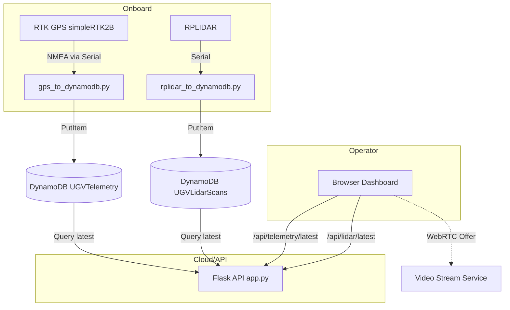
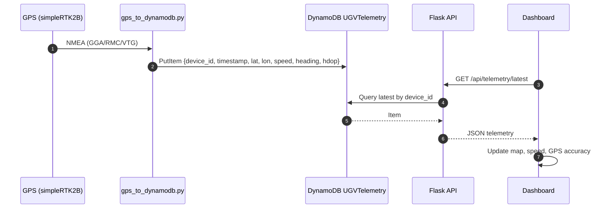

# System Architecture

This document outlines the high-level components, data flows, and interfaces of the autonomous vehicle system for orchard operations.

## Components
- Onboard sensors and bridges
  - RTK GPS (simpleRTK2B, ZED-F9P) → `gps_to_dynamodb.py`
  - LiDAR (SLAMTEC RPLIDAR) → `rplidar_to_dynamodb.py`
- Backend API
  - Flask (`app.py`), environment-driven
  - DynamoDB tables: `UGVTelemetry`, `UGVLidarScans`
- Frontend dashboard
  - `index.html`, `script.js`, `config.js`
  - Leaflet map, RealSense/WebRTC placeholder

## Architecture Diagram

## Data Model (DynamoDB)
- `UGVTelemetry`
  - PK: `device_id` (S)
  - SK: `timestamp` (N)
  - Attributes: `lat`, `lon`, `speed`, `heading`, `gps_accuracy_hdop`
- `UGVLidarScans`
  - PK: `device_id` (S)
  - SK: `timestamp` (N)
  - Attributes: `summary` (min, max, median distances)

## Telemetry Flow (Sequence)

## Configuration
- Backend: `.env` → `AWS_REGION`, `DDB_ENDPOINT_URL`, `DDB_TABLE_NAME`, `LIDAR_TABLE_NAME`, `DEVICE_ID`, `FLASK_HOST/PORT`
- Frontend: `config.js` → `API_BASE_URL`, `WEBRTC_OFFER_URL`
- Serial: `GPS_SERIAL_PORT`, `RPLIDAR_PORT`

## Operational Notes
- Replace Scan with Query for reads (done) and maintain time-ordered writes.
- Ensure RTK correction setup for simpleRTK2B; antenna quality is critical. Reference: [simpleRTK2B Budget](https://www.ardusimple.com/product/simplertk2b/)
- For LiDAR, the Python wrapper is used for summaries; consider the official SDK for advanced use: `https://github.com/slamtec/rplidar_sdk` 